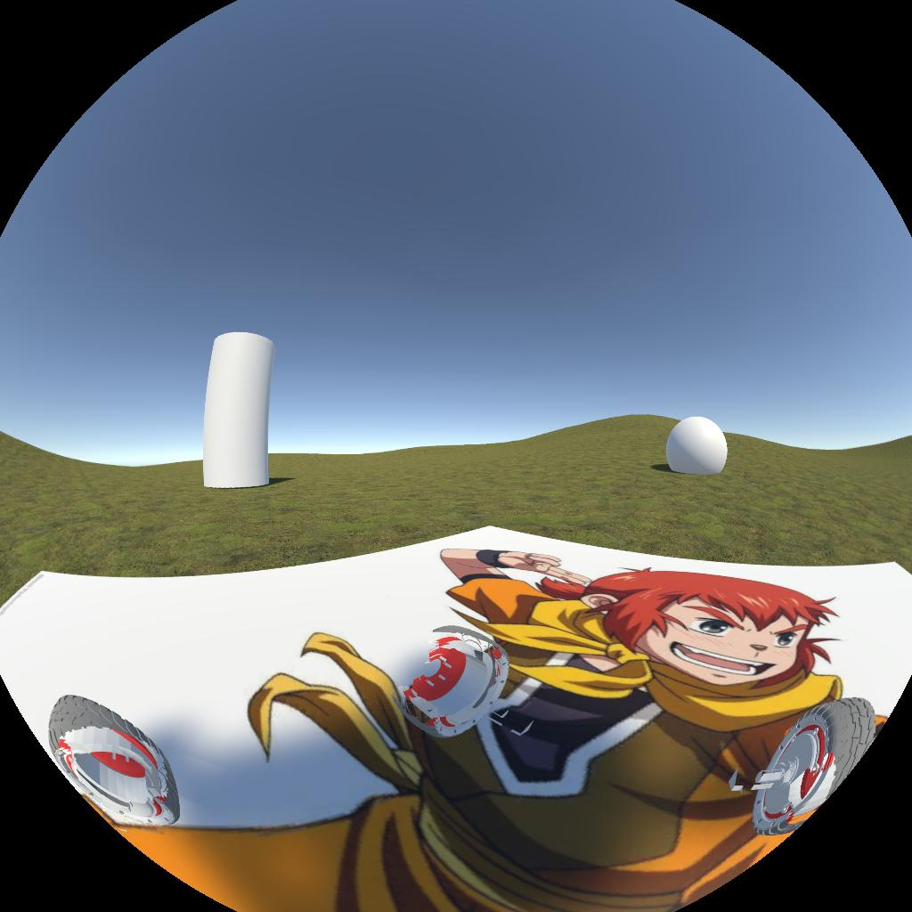
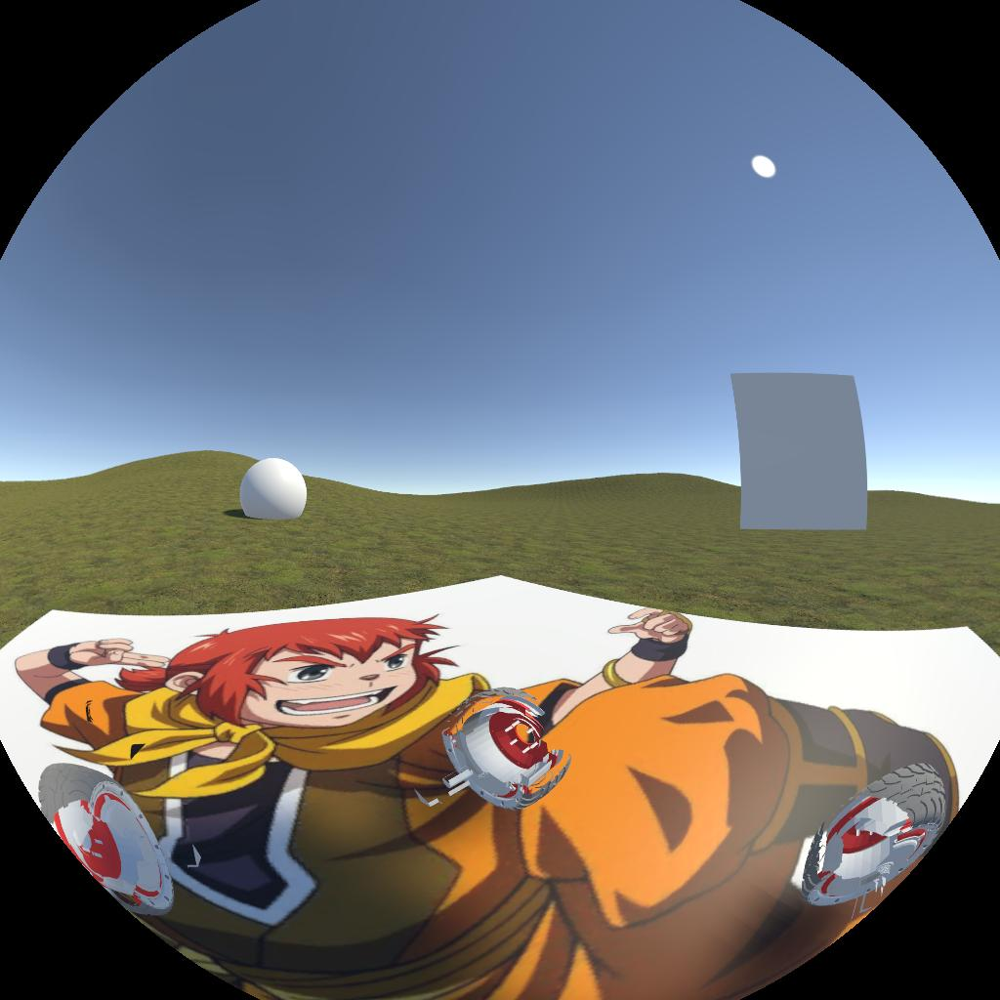
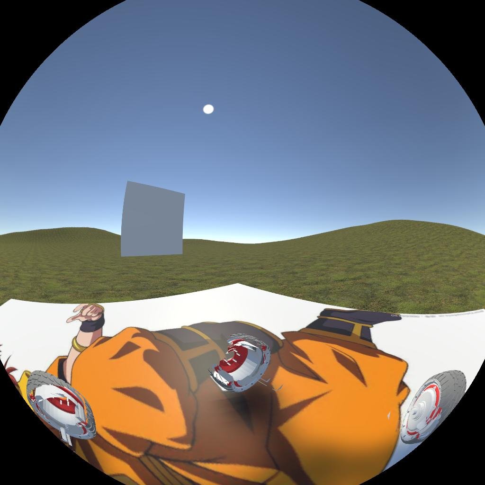
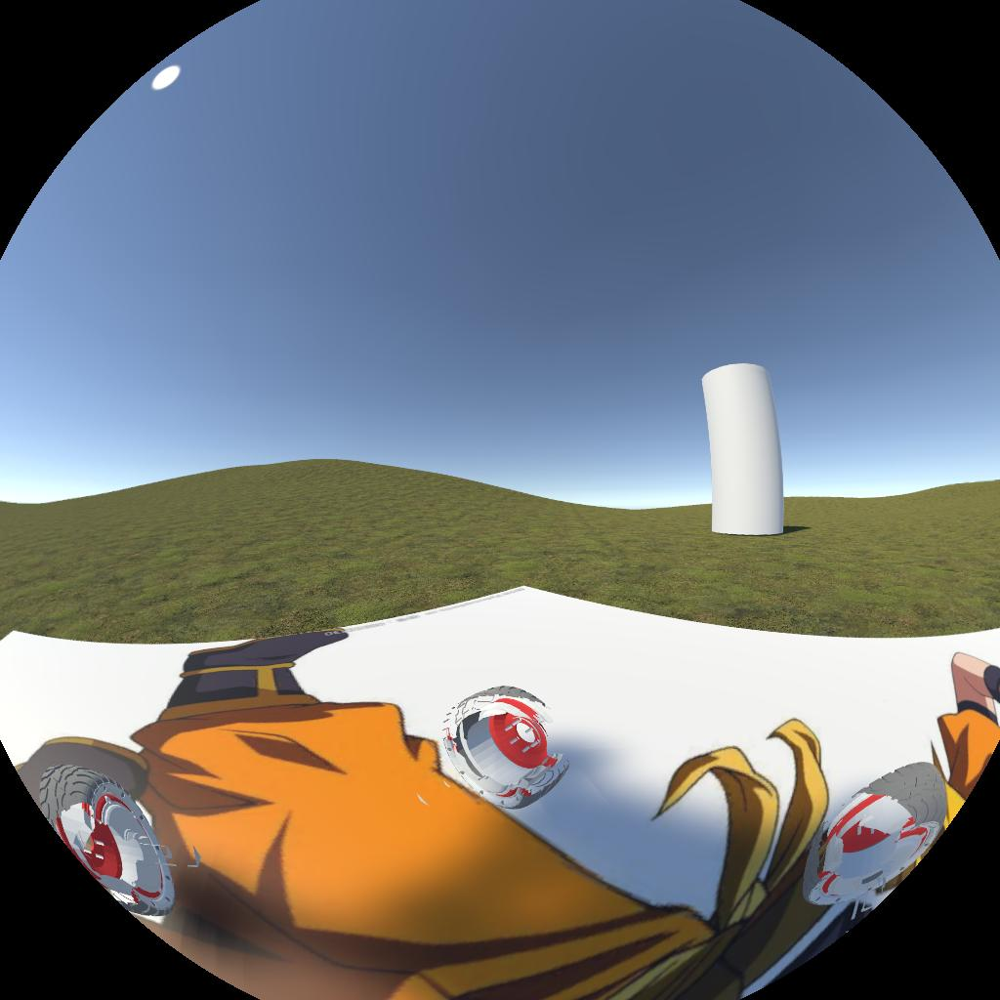
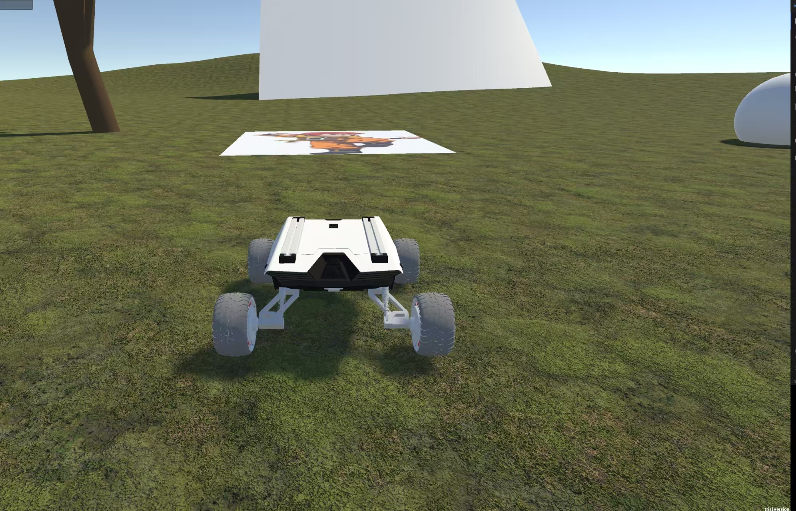

[English] | [简体中文](README_CN.md)

# 2D|3D BEV ROS Pipeline (Unity + ROS)

This repository contains:
- a Unity simulation executable
- a Python toolkit supporting **PINHOLE | KB | UCM | EUCM | DS | OCAM** camera models and **2D|3D BEV (Bird's-Eye View)** generation
- **ROS integration** to receive/synchronize fisheye camera topics and quickly generate BEV views with lookup tables

## 2D BEV Demo


## 3D BEV Demo


## Original fisheye images






## Project Structure

- Unity game directory: [unity_game/](unity_game/)
- Python scripts directory: [python_scripts/](python_scripts/)

Key Python files:
- BEV LUT build pipeline: [python_scripts/build_bev.py](python_scripts/build_bev.py)
- Global config: [python_scripts/config.py](python_scripts/config.py)
- Camera calibration config: [python_scripts/calibration/calibration.yaml](python_scripts/calibration/calibration.yaml)
- BEV ROS node: [python_scripts/test_bev_ros.py](python_scripts/test_bev_ros.py)
- Multi-camera model implementations: [python_scripts/camera_models/](python_scripts/camera_models/)

## Requirements

- Python 3.8+
- Numpy
- opencv-python
- [ROS](https://www.ros.org/)
- [ROS-TCP-Endpoint](https://github.com/Unity-Technologies/ROS-TCP-Endpoint)

## Quick Start

### 1) Clone this project(Please clone the submodule)

```
git clone https://github.com/canyueduxuan/Open-3D-Surround-View-ros.git
cd Open-3D-Surround-View-ros
git submodule update --init --recursive

```

### 2) Start the Unity game

```bash
cd unity_game
./unity_game.x86_64
```

You should see the scene:



### 3) Start [ROS-TCP-Endpoint](https://github.com/Unity-Technologies/ROS-TCP-Endpoint)

Note: the game script uses ROS IP `127.0.0.1:10000` by default. If your ROS-TCP-Endpoint uses different settings, update its launch file.

```bash
cd ROS-TCP-Endpoint
source devel/setup.bash
roslaunch ros_tcp_endpoint endpoint.launch
```

### 4) Build BEV lookup tables (LUT) and outputs

From repository root:

```bash
cd python_scripts
python build_bev.py
```

### 5) Run the `test_bev_ros` node

```bash
cd python_scripts
python test_bev_ros.py --mode both
```

Modes:
- `--mode 2d`: enable 2D BEV only
- `--mode 3d`: enable 3D BEV only
- `--mode both`: enable 2D + 3D BEV together (may be laggy)

Default subscribed topics:
- `/front_left/compressed`
- `/front_right/compressed`
- `/back_right/compressed`
- `/back_left/compressed`

If your topic names are different, update [python_scripts/test_bev_ros.py](python_scripts/test_bev_ros.py).

## Calibration/Data Paths

Generated/used folders under [python_scripts/](python_scripts/):
- `calibration/intrinsics/params`
- `calibration/extrinsics/params`
- `data/bev_2d/luts`
- `data/bev_2d/debug`
- `data/bev_3d/luts`
- `data/bev_3d/debug`

# Acknowledgements

- [Open-3D-Surround-View](https://github.com/nick8592/Open-3D-Surround-View): much of the code is based on this repository, which includes a complete 2D|3D BEV tutorial.
- [YOPO-Sim](https://github.com/TJU-Aerial-Robotics/YOPO-Sim): provides a Unity simulation environment with ROS and multi-sensor integration.

# License [MIT License](LICENSE)
